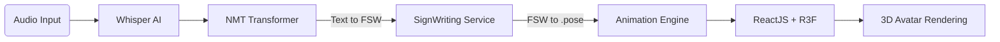

Here is the English version of the README, professionally formatted for GitHub with all icons/emojis removed.

---

# Speech-to-Sign Language System based on SignWriting

**Bachelor Thesis in Software Engineering**

*A paradigm shift from Semantic Translation (Gloss-based) to Morphological Synthesis (SignWriting-based) for 3D Sign Language Reproduction.*

## Project Overview

This project researches and implements a **Speech-to-Sign Language** system using **SignWriting** as the intermediate representation format. Unlike traditional approaches that rely on "Gloss" (which often leads to a loss of spatial information and non-manual markers), this system adopts a **Text-to-FSW (Formal SignWriting) -> 3D Animation** pipeline.

The primary objective is to generate sign language gestures that are morphologically accurate (hand positioning, palm orientation, facial expressions) and scalable across different sign languages.

## Problem Statement and Solution

### The Limitation of Gloss

Most current Sign Language Translation (SLT) systems use Gloss (labeling signs with spoken words), which results in:

* **Loss of Spatial Information:** Gloss is linear and abstract, failing to describe 3D positioning or movement direction.
* **Lack of Non-Manual Markers (NMMs):** Critical grammatical elements like eyebrow raising or cheek puffing are often ignored.
* **Spoken Language Dependency:** Gloss imposes the grammar of the spoken language onto the sign language.

### The SignWriting Advantage

By utilizing SignWriting (SW), specifically the **Formal SignWriting (FSW)** standard, this project achieves:

* **Morphological Representation:** Records *how* a sign is performed rather than *what* it means, using the ISWA 2010 symbol set.
* **Machine Learning Compatibility:** FSW treats 2D spatial structures as ASCII strings, making them processable by Transformer models.
* **Language Independence:** The animation algorithms are based on geometric symbols, allowing applicability across various sign languages (VSL, ASL, DGS).

## System Architecture

The system is built on a Microservices architecture, integrating a Deep Learning pipeline into a modern Web application.

### 1. High-Level Data Flow



### 2. Processing Pipeline

**A. Speech Recognition & Translation (AI Service)**

* **Input:** Spoken Vietnamese audio.
* **ASR:** Utilizes **OpenAI Whisper** for high-accuracy speech-to-text conversion.
* **Translation (NMT):**
* Implements a **Seq2Seq Transformer** model (adapted from `signwriting-translation`).
* Converts Natural Language text into FSW Strings (e.g., `M525x535S2e748...`).
* Trained on bilingual datasets from **SignBank+** and **SignPuddle**.


**B. Motion Generation (Lifting 2D to 3D)**

* **Converter:** Transforms 2D FSW strings into 3D motion data.
* **Methodology:** Combines **Rule-based** approaches (for structural accuracy) with **Deep Learning (VQ-VAE)** (for motion smoothing).
* **Output Format:** `.pose` files (Binary format optimized for bandwidth).
* **Skeleton Standard:** Compatible with **MediaPipe Holistic** (543 landmarks).

**C. 3D Rendering & Kinematics (Frontend)**

* **Parser:** Decodes `.pose` files using the `pose-format` library.
* **Kinematics Solver:** Uses **Kalidokit** to solve Inverse/Forward Kinematics, converting raw Landmarks (x, y, z) into Joint Rotations for the 3D Avatar.
* **Visualization:** Renders standard **VRM** models using **React Three Fiber**.

## Technology Stack

| Component | Technology | Role |
| --- | --- | --- |
| **Frontend** | ReactJS, React Three Fiber | User Interface, 3D Rendering context |
| **3D Logic** | Kalidokit, MediaPipe, Three.js | Kinematics solving, Avatar control |
| **Backend** | Java Spring Boot | Orchestrator, Authentication, Session Management |
| **AI Service** | Python FastAPI | Core Processing API (ASR, NMT, Animation) |
| **Machine Learning** | PyTorch, Sockeye, Whisper | Model training & Inference |
| **Database** | PostgreSQL | User data storage, FSW Caching |
| **Data Standard** | FSW, .pose | SignWriting and Motion data standards |

## Repository Structure

```bash
├── ai-service/             # Python FastAPI (ASR, Translation, Motion Gen)
│   ├── models/             # Directory for pre-trained models
│   └── src/                # Logic for handling FSW and .pose generation
├── backend/                # Java Spring Boot (API Gateway, Business Logic)
├── frontend/               # ReactJS Application
│   ├── src/components/3d/  # R3F components & VRM Avatar loader
│   └── src/utils/          # Pose file parsers & Kalidokit integration
└── docker-compose.yml      # Container orchestration configuration

```

## Technical Challenges & Solutions

**Challenge:** The "Lifting" Problem (2D to 3D)
Converting static 2D SignWriting symbols into dynamic 3D motion is non-trivial due to depth ambiguity.

**Solution:**

* Leveraged the `signwriting-animation` library to infer depth based on symbol configuration.
* Integrated `Kalidokit` to calculate biomechanically accurate joint rotations.
* Applied spherical linear interpolation (SLERP) and smoothing filters to reduce jitter in the generated animation.

## References

This project utilizes and builds upon the following open-source research and libraries:

1. **Sutton SignWriting:** [https://www.signwriting.org](https://www.signwriting.org)
2. **Sign Language Processing Ecosystem:** [https://github.com/sign-language-processing](https://github.com/sign-language-processing)
* `signwriting-translation`
* `signwriting-animation`
* `pose-format`


3. **Kalidokit:** [https://github.com/yeemachine/kalidokit](https://github.com/yeemachine/kalidokit)
4. **React Three Fiber:** [https://github.com/pmndrs/react-three-fiber](https://github.com/pmndrs/react-three-fiber)